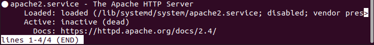
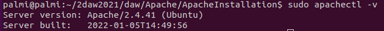
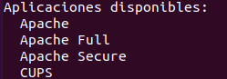
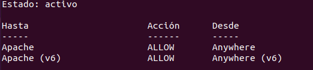
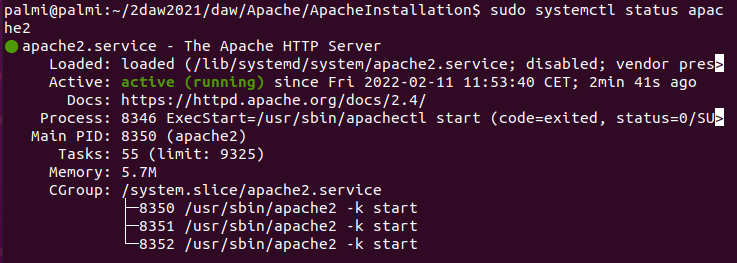
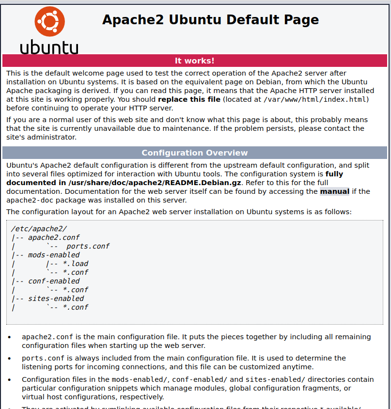

# - [Apache](#apache)
- [Introducción](#introducción)
- [¿Qué es apache?](#que-es-apache)
- [Instalación](#instalación)
- [Instalación](#instalación-1)
- [Configuración](#configuración)
- [Servidor Virtual de apache](#servidor-virtual-de-apache)
- [Conclusión](#conclusión)

## Introducción
Vamos a realizar la instalación y configuración de Apache.
### ¿Qué es apache?
Es un servidor web HTTP de código abierto. A su vez el servidor web más usado en el mundo desde 1996.
## Instalación

### Instalación
Primero actualizamos el sistema
~~~
sudo apt update
~~~
Después instalamos apache
~~~
sudo apt install apache2
~~~
Comprobamos el estado de apache
~~~
systemctl status apache2
~~~

Para ver la versión de apache que tenemos instalada
~~~
sudo apachectl -v
~~~

Ahora activamos el cortafuegos, primero veremos la lista de los cortafuegos.

~~~
sudo ufw app list
~~~
Entonces nos saldrán la lista de perfiles de las aplicaciónes.

Seleccionamos uno de ellos.
~~~
sudo ufw allow Apache
~~~
Verificamos el cambio
~~~
sudo ufw status
~~~
Si sale inactivo, lo tendremos que activar
~~~
sudo ufw enable
~~~

### Verificamos el servidor

Verificamos el sistema base.
~~~
sudo systemctl status apache2
~~~
y nos aparecera lo siguiente.

Cuando tengamos la direccion ip del servidor, introducimos la siguiente direccion en el navegador.
~~~
127.0.1.1 (En mi caso)
~~~
Y nos debera salir esto

### Administracion del proceso de apache

iniciar el servidor:
~~~
sudo systemctl start apache2
~~~

Reiniciar el servidor:
~~~
sudo systemctl restart apache2
~~~

Detener el servidor:
~~~
sudo systemctl stop apache2
~~~

Recargar el servidor:
~~~
sudo systemctl reload apache2
~~~

### Servidor Virtual de apache
Ahora vamos a crear un servidor virtual que responda al dominio ejemplo.com.
~~~
sudo mkdir -p /var/www/ejemplo.com/html
~~~
Asignamos el usuario propietario.
~~~
sudo chown -R $USER:$USER /var/www/ejemplo.com/html
~~~
Creamos el index.
~~~
nano /var/www/ejemplo.com/html/index.html
~~~
Dentro del index
~~~
<HTML>
  <head>
    <title>Bienvenido</title>
  </head>
  <body>
    h1>Funciona</h1>
  </body>
</HTML>
~~~
Guardamos y cerramos
Ahora creamos un archivo de alojamiento virtual.
~~~
sudo nano /etc/apache2/sites-available/ejemplo.com.conf
~~~
Dentro del archivo

~~~
<VirtualHost *:80>
    ServerAdmin admin@ejemplo.com
    ServerName ejemplo.com
    ServerAlias www.ejemplo.com
    DocumentRoot /var/www/ejemplo.com/html
    ErrorLog ${APACHE_LOG_DIR}/error.log
    CustomLog ${APACHE_LOG_DIR}/access.log combined
</VirtualHost>
~~~
Guardamos los cambios y activamos el servidor virtual
~~~
sudo a2ensite ejemplo.com.conf
~~~
Desabilitamos el sitio por defecto.
~~~
sudo a2dissite 000-default.conf
~~~
Probamos la configuracion.
~~~
sudo apache2ctl configtest
~~~
y recargamos la configuracion de apache
~~~
sudo systemctl reload apache2
~~~

## Conclusión
En este proyecto hemos realizado la instalación de apache y posteriormente su configuracion. En la cual primero hemos cargado la página principal de apache para comprobar que el servidor funcionase correctamente y después hemos cargado una web en el puesto de la de apache. 
